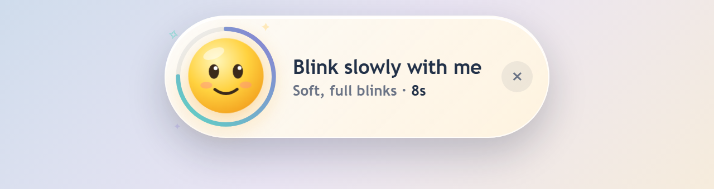
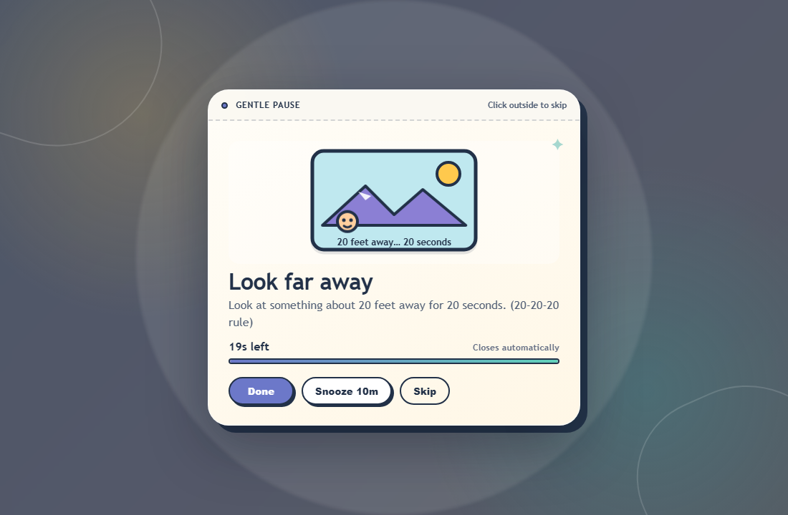
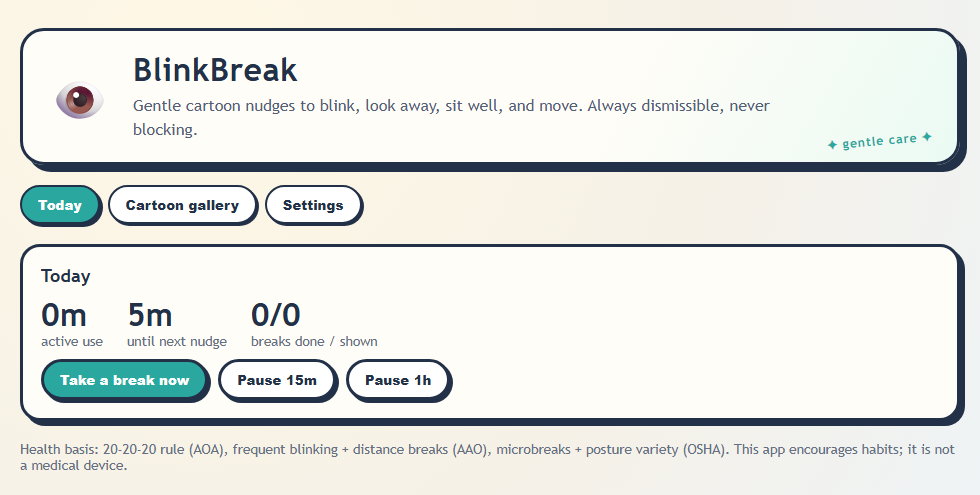

# BlinkBreak 👁️ — gentle cartoon health reminders

[](https://github.com/muhammedrinshidvpr-coder/blinkbreak/actions/workflows/build-windows.yml)
[](https://github.com/muhammedrinshidvpr-coder/blinkbreak/releases/latest)


A lightweight Windows desktop app (Tauri 2 + React + Rust) that lives in the
system tray and nudges you to **blink, look away, sit well, and move** during
long screen sessions. Every reminder is gentle and dismissible, never steals
your typing, and closes by itself.



## Download

1. Go to **[Releases](https://github.com/muhammedrinshidvpr-coder/blinkbreak/releases/latest)**
   and download `BlinkBreak_x.y.z_x64-setup.exe`.
2. Run it. No admin rights needed; it installs just for your user.

> **"Windows protected your PC"?** The installer isn't code-signed yet (signing
> certificates cost money), so Windows SmartScreen doesn't recognise it. Click
> **More info → Run anyway**. If you'd rather not trust a binary, build it
> yourself from source (below); the code is short enough to read.

Requires Windows 10 or 11 (WebView2, which Windows already includes).

## How reminders appear

**Blink** is a small animated emoji at the top center of your screen. It blinks
slowly with you, a ring counts down the time, and then it floats away. It never
dims the screen. Click it when you're done, or × to skip.

**Everything else** gets a soft dimmed overlay on the monitor you're using,
with a cartoon card in the middle:



- **Done / Snooze / Skip** buttons. Snooze shows its real length (10m, 15m, 30m…).
  Clicking outside the card skips.
- Every reminder **closes automatically** when its time runs out. A native
  safety timer closes it even if something goes wrong in the UI.
- Reminders **never steal keyboard focus**, so you can keep typing.
- Fullscreen games, videos, and presentations aren't interrupted: reminders
  wait until fullscreen ends.
- Two reminders never stack.

## Reminders

| Reminder | Every (active use) | Shown for | Style | If it times out |
|---|---|---|---|---|
| Blink | 5 min | 10 s | top-center emoji | counts as done |
| Look away | 20 min | 20 s (20-20-20 rule) | overlay | counts as done |
| Posture | 30 min | 20 s | overlay | counts as skipped |
| Move | 60 min | 5 min | overlay | counts as skipped |
| Long rest | 2 h | 10 min | overlay | counts as skipped |

Timers count **active use only**. They pause when you're idle or your PC is
asleep. Intervals, on/off per reminder, quiet hours, reduced motion, and
start-with-Windows are all in **Settings**.

Health basis: AOA 20-20-20 rule, AAO blink/look-away guidance, OSHA
microbreak and posture guidance. This app encourages habits; it is not a
medical device.



## Start with Windows

**Settings → Start with Windows** is on by default. On sign-in, BlinkBreak
starts **minimized to the tray** with no window popping up. The tray menu has
**Open dashboard**, **Take a break now**, **Pause 15 min**, and **Quit**.
Closing the dashboard hides it back to the tray; only Quit exits.

## Privacy

Fully local. No webcam, no keylogging, no cloud, no account, no telemetry, no
network requests. The only OS signal the app reads is idle *seconds* (Win32
`GetLastInputInfo`), to tell active use from idle time. Settings and daily
stats stay on your machine.

## Build from source

Frontend only (browser demo with a simulated activity clock, no Rust needed):

```powershell
npm install
npm test        # unit + component tests
npm run lint    # TypeScript check
npm run dev     # browser demo at http://localhost:1420
```

Desktop app (needs [Rust](https://rustup.rs) stable MSVC + Visual Studio C++ build tools):

```powershell
npm run tauri dev     # run the desktop app with hot reload
npm run tauri build   # -> src-tauri/target/release/bundle/nsis/BlinkBreak_*_setup.exe
```

> Only one BlinkBreak can run at a time. Quit the installed copy from the tray
> before `npm run tauri dev`, or the dev build will hand over to it and exit.

## Contributing

Ideas, bug reports, and PRs are welcome. See [CONTRIBUTING.md](CONTRIBUTING.md)
and the [Code of Conduct](CODE_OF_CONDUCT.md). Security reports:
[SECURITY.md](SECURITY.md).

## License

MIT. See [LICENSE](LICENSE).
