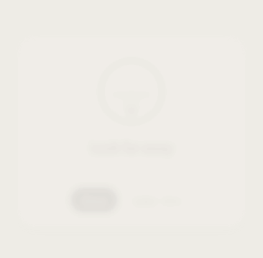
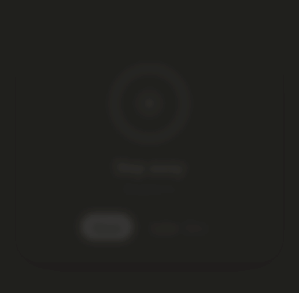
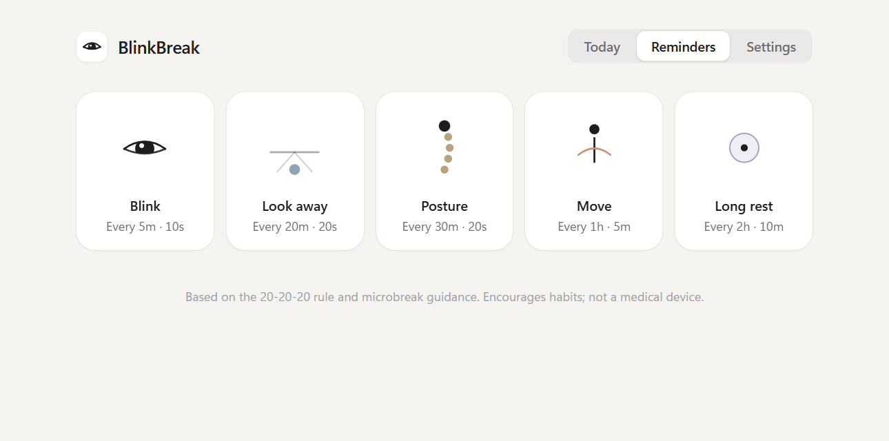
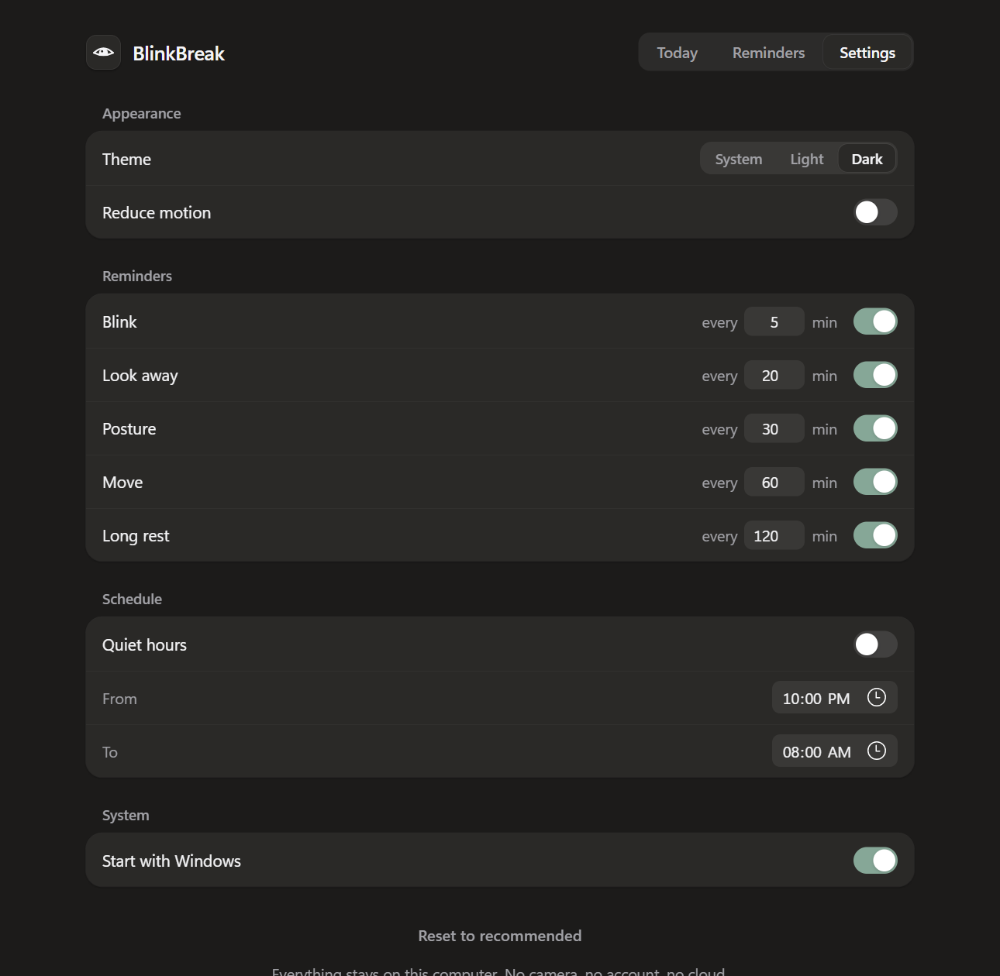

<div align="center">

# BlinkBreak

**Calm reminders to blink, look away, and move.**<br>
A small, private Windows app for long screen sessions.

[](https://github.com/muhammedrinshidvpr-coder/blinkbreak/releases/latest)

[](https://github.com/muhammedrinshidvpr-coder/blinkbreak/releases/latest)
[](https://github.com/muhammedrinshidvpr-coder/blinkbreak/actions/workflows/build-windows.yml)


</div>

## Why BlinkBreak?

- **Private.** No internet, no account, no tracking. Nothing leaves your PC.
- **Quiet.** Reminders never take your keyboard focus, and they wait while a fullscreen game, video, or presentation is open.
- **Brief.** Every reminder leaves on its own when its time is up.

## Reminders

Each reminder is a small symbol whose motion *is* the exercise. It is timed to
fit the reminder exactly, and a thin ring shows the time left.

<p align="center">
  
  &nbsp;&nbsp;
  
</p>

| Reminder | Every (active use) | For | Motion |
|---|---|---|---|
| Blink | 5 min | 10 s | an eye lowers its lid, rests, and lifts: four slow blinks |
| Look away | 20 min | 20 s | a dot drifts out to the horizon (the 20-20-20 rule) |
| Posture | 30 min | 20 s | a curved column of dots eases upright |
| Move | 60 min | 5 min | arms lift in one slow arc |
| Long rest | 2 h | 10 min | a circle breathes: in for 4 s, out for 6 s |

Timers count **active use only**, so they pause when you step away or your PC sleeps.
**Done** records the break, **Later** snoozes it (the length is shown), and clicking
anywhere outside the card dismisses it. When time runs out, blink and look-away
count as done, because following the countdown *is* the exercise.

## Light and dark

BlinkBreak follows Windows by default. Choose **Settings → Appearance → Light** or **Dark** to set it yourself.

<p align="center">
  
  
</p>

## Install

**New to this?** Follow the [step-by-step install guide](docs/INSTALL.md). It takes about a minute.

1. **[Download the latest installer](https://github.com/muhammedrinshidvpr-coder/blinkbreak/releases/latest)**
   (`BlinkBreak_x.y.z_x64-setup.exe`, about 2 MB).
2. Run it. No admin rights needed; it installs just for you.
3. BlinkBreak starts in your **system tray** (bottom right, maybe under the ^ arrow).
   Right-click it for **Open dashboard**, **Take a break now**, **Pause 15 min**, and **Quit**.

## FAQ

<details>
<summary><b>Windows says "Windows protected your PC". Is it safe?</b></summary>

The installer isn't code-signed yet (signing certificates cost money), so
SmartScreen doesn't recognise it. Click **More info → Run anyway**. Each
release lists a SHA-256 checksum you can compare with
`Get-FileHash .\BlinkBreak_x.y.z_x64-setup.exe`. Or build it yourself from
source; the code is short enough to read.
</details>

<details>
<summary><b>Will it interrupt my game, movie, or presentation?</b></summary>

No. If a fullscreen app is in front, reminders wait until you leave
fullscreen. Reminders also never take keyboard focus, so your typing keeps
going where it was.
</details>

<details>
<summary><b>How do I pause it or turn a reminder off?</b></summary>

Tray icon → **Pause 15 min**, or open the dashboard for **Pause 1h**. In
**Settings** you can switch each reminder on/off, change how often it
appears, set quiet hours, and pick light or dark.
</details>

<details>
<summary><b>Does it start with Windows?</b></summary>

Yes, by default, quietly in the tray. Turn it off in **Settings → Start with Windows**.
</details>

<details>
<summary><b>How do I uninstall it?</b></summary>

Windows **Settings → Apps → Installed apps → BlinkBreak → Uninstall**.
Quit it from the tray first.
</details>

<details>
<summary><b>What data does it collect?</b></summary>

None. The only thing it reads from Windows is how many seconds since your last
keyboard/mouse input (to know whether you're active). Settings and daily stats
stay on your machine.
</details>

<details>
<summary><b>Mac or Linux?</b></summary>

Not yet. It's Windows-only today. Follow or help with
[issue #5](https://github.com/muhammedrinshidvpr-coder/blinkbreak/issues/5).
</details>

## Health basis

Based on the AOA 20-20-20 rule, AAO guidance on blinking and distance breaks,
and OSHA microbreak and posture guidance. BlinkBreak encourages healthy
habits; it is not a medical device.

## Build from source

Frontend only (browser demo with a simulated activity clock, no Rust needed):

```powershell
npm install
npm test        # unit + component tests
npm run lint    # TypeScript check
npm run dev     # browser demo at http://localhost:1420
```

Desktop app (needs [Rust](https://rustup.rs) stable MSVC + Visual Studio C++ build tools):

```powershell
npm run tauri dev     # run the desktop app with hot reload
npm run tauri build   # -> src-tauri/target/release/bundle/nsis/BlinkBreak_*_setup.exe
```

> Only one BlinkBreak can run at a time. Quit the installed copy from the tray
> before `npm run tauri dev`, or the dev build will hand over to it and exit.

Built with [Tauri 2](https://tauri.app), React, TypeScript, and Rust.

## Contributing

Ideas, bug reports, designs, and PRs are all welcome. Good places to start are
issues labelled
[`good first issue`](https://github.com/muhammedrinshidvpr-coder/blinkbreak/labels/good%20first%20issue).
See [CONTRIBUTING.md](CONTRIBUTING.md) and the
[Code of Conduct](CODE_OF_CONDUCT.md). Questions →
[Discussions](https://github.com/muhammedrinshidvpr-coder/blinkbreak/discussions).
Security reports → [SECURITY.md](SECURITY.md). What's changed →
[CHANGELOG.md](CHANGELOG.md).

## License

MIT. See [LICENSE](LICENSE).
